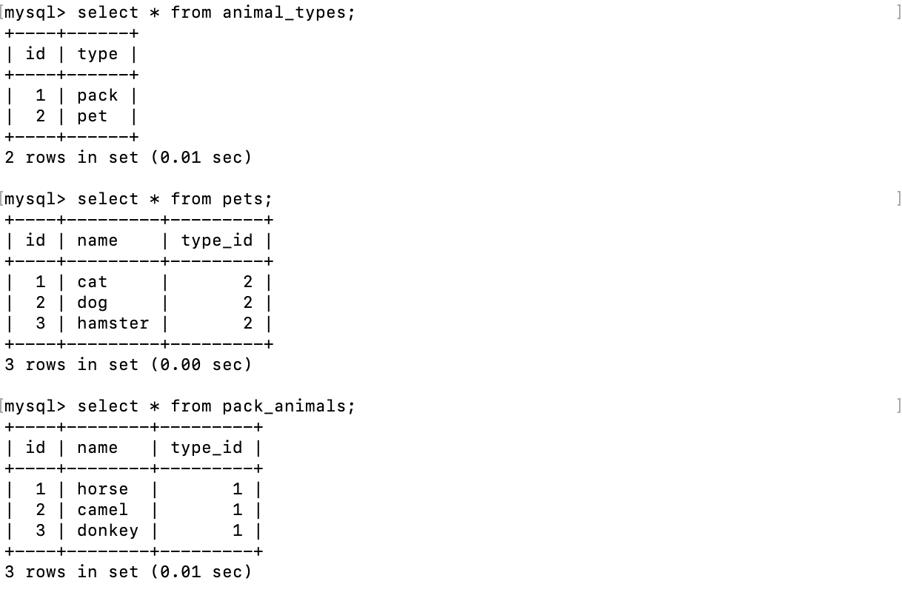

# Итоговая контрольная работа по блоку специализация

1. Используя команду cat в терминале операционной системы Linux, создать два файла Домашние животные (заполнив файл собаками, кошками, хомяками) и Вьючные животными заполнив файл Лошадьми, верблюдами и ослы), а затем объединить их. Просмотреть содержимое созданного файла. Переименовать файл, дав ему новое имя (Друзья человека).
    
    
2. Создать директорию, переместить файл туда.

    
3. Подключить дополнительный репозиторий MySQL. Установить любой пакет из этого репозитория.

   
   
   
4. Установить и удалить deb-пакет с помощью dpkg.

   
5. Выложить историю команд в терминале ubuntu
6. Нарисовать диаграмму, в которой есть класс родительский класс, домашние животные и вьючные животные, в составы которых в случае домашних животных войдут классы: собаки, кошки, хомяки, а в класс вьючные животные войдут: Лошади, верблюды и ослы).

   
7. В подключенном MySQL репозитории создать базу данных “Друзья человека”
```roomsql
CREATE DATABASE human_friends;
```
8. Создать таблицы с иерархией из диаграммы в БД
```roomsql
USE human_friends;

CREATE TABLE animal_types
(
	id INT AUTO_INCREMENT PRIMARY KEY, 
	type VARCHAR(200)
);

INSERT INTO animal_types (type)
VALUES ('pack'),
('pet');  

CREATE TABLE pack_animals
(
	id INT AUTO_INCREMENT PRIMARY KEY,
    name VARCHAR (200),
    type_id INT,
    FOREIGN KEY (type_id) REFERENCES animal_types (id) ON DELETE CASCADE ON UPDATE CASCADE
);

INSERT INTO pack_animals (name, type_id)
VALUES ('horse', 1),
('camel', 1),  
('donkey', 1); 
    
CREATE TABLE pets
(
	  id INT AUTO_INCREMENT PRIMARY KEY,
    name VARCHAR (200),
    type_id INT,
    FOREIGN KEY (type_id) REFERENCES animal_types (id) ON DELETE CASCADE ON UPDATE CASCADE
);

INSERT INTO pets (name, type_id)
VALUES ('cat', 2),
('dog', 2),  
('hamster', 2); 

CREATE TABLE cats 
(       
    id INT AUTO_INCREMENT PRIMARY KEY, 
    name VARCHAR(200), 
    birthday DATE,
    commands VARCHAR(200),
    subtype_id int,
    Foreign KEY (subtype_id) REFERENCES pets (id) ON DELETE CASCADE ON UPDATE CASCADE
);
```

9. Заполнить низкоуровневые таблицы именами(животных), командами которые они выполняют и датами рождения
```roomsql
INSERT INTO cats (name, birthday, commands, subtype_id)
VALUES ('Lisa', '2011-01-01', "jump", 1),
('Mia', '2016-01-01', "sleep", 1),  
('Tom', '2017-01-01', "go", 1); 

CREATE TABLE dogs 
(       
    id INT AUTO_INCREMENT PRIMARY KEY, 
    name VARCHAR(200), 
    birthday DATE,
    commands VARCHAR(200),
    subtype_id int,
    Foreign KEY (subtype_id) REFERENCES pets (id) ON DELETE CASCADE ON UPDATE CASCADE
);

INSERT INTO dogs (name, birthday, commands, subtype_id)
VALUES ('Joy', '2020-01-01', "go, jump, stop, sing", 2),
('Andi', '2021-06-12', "go, sing", 2),  
('Toy', '2018-05-01', "seat, no", 2), 
('Tigra', '2021-05-10', "seat", 2);

CREATE TABLE hamsters 
(       
    id INT AUTO_INCREMENT PRIMARY KEY, 
    name VARCHAR(200), 
    birthday DATE,
    commands VARCHAR(200),
    subtype_id int,
    Foreign KEY (subtype_id) REFERENCES pets (id) ON DELETE CASCADE ON UPDATE CASCADE
);

INSERT INTO hamsters (name, birthday, commands, subtype_id)
VALUES ('Micky', '2020-10-12', "", 3),
('Ted', '2021-03-12', "play", 3),  
('Bonya', '2022-07-11', "run", 3), 
('Kuzya', '2022-05-10', "run, play", 3);

CREATE TABLE horses 
(       
    id INT AUTO_INCREMENT PRIMARY KEY, 
    name VARCHAR(200), 
    birthday DATE,
    commands VARCHAR(200),
    subtype_id int,
    Foreign KEY (subtype_id) REFERENCES pack_animals (id) ON DELETE CASCADE ON UPDATE CASCADE
);

INSERT INTO horses (name, birthday, commands, subtype_id)
VALUES ('Jack', '2020-01-12', "run, step, stop", 1),
('Denny', '2017-03-12', "run", 1),  
('Buyvol', '2016-07-12', "stop", 1), 
('Sammy', '2020-11-10', "", 1);

CREATE TABLE donkeys 
(       
    id INT AUTO_INCREMENT PRIMARY KEY, 
    name VARCHAR(20), 
    birthday DATE,
    commands VARCHAR(50),
    subtype_id int,
    Foreign KEY (subtype_id) REFERENCES pack_animals (id) ON DELETE CASCADE ON UPDATE CASCADE
);

INSERT INTO donkeys (name, birthday, commands, subtype_id)
VALUES ('Mick', '2019-04-10', "", 2),
('Jhonny', '2020-03-12', "go, stop", 2),  
('Tito', '2021-07-12', "go", 2);

CREATE TABLE camels 
(       
    id INT AUTO_INCREMENT PRIMARY KEY, 
    name VARCHAR(20), 
    birthday DATE,
    commands VARCHAR(50),
    subtype_id int,
    Foreign KEY (subtype_id) REFERENCES pack_animals (id) ON DELETE CASCADE ON UPDATE CASCADE
);

INSERT INTO camels (name, birthday, commands, subtype_id)
VALUES ('Mig', '2022-04-10', "go", 3),
('Taifoon', '2019-03-12', "stop", 3);
```


10. Удалив из таблицы верблюдов, т.к. верблюдов решили перевезти в другой питомник на зимовку. Объединить таблицы лошади, и ослы в одну таблицу.
```roomsql
DELETE FROM camels;

CREATE TABLE hd_union
SELECT  * FROM horses
UNION 
SELECT  * FROM donkeys;
```

11. Создать новую таблицу “молодые животные” в которую попадут все животные старше 1 года, но младше 3 лет и в отдельном столбце с точностью до месяца подсчитать возраст животных в новой таблице
```roomsql
DROP TABLE IF EXISTS animals;

CREATE TEMPORARY TABLE animals AS
SELECT all_pets.*, pets.name as subtype_name
FROM 
(SELECT * FROM cats
UNION SELECT * FROM dogs
UNION SELECT * FROM hamsters
) all_pets
LEFT JOIN pets
ON all_pets.subtype_id=pets.id
UNION
SELECT all_pack.*, pack_animals.name as subtype_name
FROM 
(SELECT * FROM horses
UNION SELECT * FROM donkeys
UNION SELECT * FROM camels
) all_pack
LEFT JOIN pack_animals
ON all_pack.subtype_id=pack_animals.id;

CREATE TABLE young_animals AS
SELECT *, TIMESTAMPDIFF(MONTH, birthday, CURDATE()) AS age_in_month
FROM animals WHERE birthday BETWEEN ADDDATE(curdate(), INTERVAL -3 YEAR) AND ADDDATE(CURDATE(), INTERVAL -1 YEAR);
```

12. Объединить все таблицы в одну, при этом сохраняя поля, указывающие на прошлую принадлежность к старым таблицам.
```roomsql
CREATE TABLE full_table AS
SELECT all_animals.*, animal_types.type
FROM
(SELECT all_pets.*, pets.name as subtype_name, pets.type_id
FROM 
(SELECT * FROM cats
UNION SELECT * FROM dogs
UNION SELECT * FROM hamsters
) all_pets
LEFT JOIN pets
ON all_pets.subtype_id=pets.id
UNION
SELECT all_pack.*, pack_animals.name as subtype_name, pack_animals.type_id
FROM 
(SELECT * FROM horses
UNION SELECT * FROM donkeys
UNION SELECT * FROM camels
) all_pack
LEFT JOIN pack_animals
ON all_pack.subtype_id=pack_animals.id) all_animals
LEFT JOIN animal_types
ON all_animals.type_id=animal_types.id;
```

    Набор команд представлен в [скрипте SQL](./makeDatabase.sql).
13. Создать класс с Инкапсуляцией методов и наследованием по диаграмме.
14. Написать программу, имитирующую работу реестра домашних животных.
    В программе должен быть реализован следующий функционал:

    14.1. Завести новое животное

    14.2. определять животное в правильный класс

    14.3. увидеть список команд, которое выполняет животное
    
    14.4. обучить животное новым командам

    14.5. Реализовать навигацию по меню
15. Создайте класс Счетчик, у которого есть метод add(), увеличивающий̆ значение внутренней̆ int переменной̆ на 1 при нажатие “Завести новое животное” Сделайте так, чтобы с объектом такого типа можно было работать в блоке try-with-resources. Нужно бросить исключение, если работа с объектом типа счетчик была не в ресурсном try и/или ресурс остался открыт. Значение считать в ресурсе try, если при заведения животного заполнены все поля.
    
    Проект программы лежит по [ссылке](./src/main/java/org/example
    ).